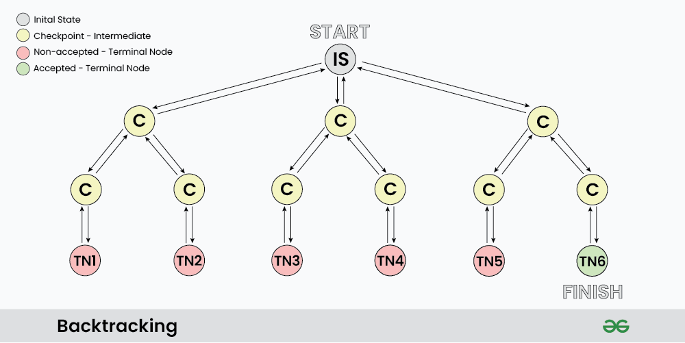

# What is BackTracking ?
```bash
Backtracking algorithms are like problem-solving strategies
 that help explore different options to find the best solution. 
 They work by trying out different paths and if one doesn't work, 
 they backtrack and try another until they find the right one. 
 It's like solving a puzzle by testing different pieces until they fit together perfectly.
```
# What is Backtracking Algorithm?
```bash
Backtracking is a problem-solving algorithmic technique
that involves finding a solution incrementally by trying different options 
and undoing them if they lead to a dead end.

It is commonly used in situations where you need to explore multiple possibilities to solve a problem, like searching for a path in a maze or solving puzzles like Sudoku. When a dead end is reached, the algorithm backtracks to the previous decision point and explores a different path until a solution is found or all possibilities have been exhausted.
```

# How Does a Backtracking Algorithm Work?
```bash
A backtracking algorithm works by recursively exploring 
all possible solutions to a problem.
It starts by choosing an initial solution, and then it explores all 
possible extensions of that solution. If an extension leads to a solution, 
the algorithm returns that solution. If an extension does not lead to a solution,
the algorithm backtracks to the previous solution and tries a different extension.
```
# The following is a general outline of how a backtracking algorithm works:
```bash
Choose an initial solution.
Explore all possible extensions of the current solution.
If an extension leads to a solution, return that solution.
If an extension does not lead to a solution, backtrack to the previous solution and try a different extension.
Repeat steps 2-4 until all possible solutions have been explored.
```

# Example of Backtracking Algorithm
```bash
Example: Finding the shortest path through a maze

Input: 
A maze represented as a 2D array, 
where 0 represents an open space and 1 represents a wall.

Algorithm:

1 Start at the starting point.
2 For each of the four possible directions 
(up, down, left, right), try moving in that direction.
3 If moving in that direction leads to the ending point, return the path taken.
4 If moving in that direction does not lead to the ending point,
backtrack to the previous position and try a different direction.

5 Repeat steps 2-4 until the ending point is reached or all possible paths have been explored.
```
# When to Use a Backtracking Algorithm?
```bash
Backtracking algorithms are best used to solve problems that have
the following characteristics:

- There are multiple possible solutions to the problem.
- The problem can be broken down into smaller subproblems.
- The subproblems can be solved independently.
```
# Applications of Backtracking Algorithm
```bash
Backtracking algorithms are used in a wide variety of applications, including:

Solving puzzles (e.g, Sudoku, crossword puzzles)
Finding the shortest path through a maze
Scheduling problems
Resource allocation problems
Network optimization problems
```
# BackTracking Defined
```bash
Backtracking can be defined as a general algorithmic technique that considers searching every possible combination in order to solve a computational problem. 
```
# Basic Terminologies
```bash

Candidate: A candidate is a potential choice or element that can be added to the current solution.

Solution: The solution is a valid and complete configuration that satisfies all problem constraints.

Partial Solution: A partial solution is an intermediate or incomplete
 configuration being constructed during the backtracking process.

Decision Space: The decision space is the set of all possible candidates 
 or choices at each decision point.

Decision Point: A decision point is a specific step in the algorithm where 
 a candidate is chosen and added to the partial solution.

Feasible Solution: A feasible solution is a partial or complete solution that adheres 
 to all constraints.

Dead End: A dead end occurs when a partial solution cannot be extended
 without violating constraints.

Backtrack: Backtracking involves undoing previous decisions and returning 
 to a prior decision point.
 
Search Space: The search space includes all possible combinations 
 of candidates and choices.
 
Optimal Solution: In optimization problems, the optimal solution 
is the best possible solution.
```
# Types of Backtracking Problems
```bash
Problems associated with backtracking
can be categorized into 3 categories:

Decision Problems: Here, we search for a feasible solution.
Optimization Problems: For this type, we search for the best solution.
Enumeration Problems: We find set of all possible feasible solutions 
to the problems of this type.
```
# How does Backtracking works?
```bash
As we know backtracking algorithm explores each and every possible 
path in order to find a valid solution, 
this exploration of path can be easily understood via given images:
```


```bash
As shown in the image, “IS”  represents the Initial State 
 where the recursion call starts to find a valid solution. 
C : it represents different Checkpoints for recursive calls
TN: it represents the Terminal Nodes where no further 
 recursive calls can be made, these nodes act as base 
 case of recursion and we determine whether the current 
 solution is valid or not at this state.

At each Checkpoint, our program makes some decisions and move to other 
 checkpoints untill it reaches a terminal Node, after 
 determining whether a solution is valid or not, the program starts to 
 revert back to the checkpoints and try to explore other paths. 
 For example in the above image TN1…TN5 are the terminal node 
 where the solution is not acceptable, while TN6 is the state 
 where we found a valid solution.

The back arrows in the images shows backtracking in actions, 
 where we revert the changes made by some checkpoint. 

```
# Determining Backtracking Problems:
```bash 
Generally every constraint satisfaction problem can be solved 
 using backtracking but, Is it optimal to use backtracking 
 every time? Turns out NO, there are a vast number of problem 
 that can be solved using Greedy or Dynamic programming in 
 logarithmic or polynomial time complexity which is far better 
 than exponential complexity of Backtracking. However many 
 problems still exists that can only be solved using Backtracking.
```

# To understand whether a problem is Backtracking based or not

```bash
let us take a simple problem:
Problem: Imagine you have 3 closed boxes, among which 2 are empty 
and 1 has a gold coin. Your task is to get the gold coin.
```
```bash
Why dynamic programming fails to solve this question: 
Does opening or closing one box has any effect on the other box? 
Turns out NO, each and every box is independent of each other 
and opening/closing state of one box can not determine 
the transition for other boxes. Hence DP fails. 


Why greedy fails to solve this question: 
Greedy algorithm chooses a local maxima in order to get 
global maxima, but in this problem each and every box has 
equal probability of having a gold coin i.e 1/3 hence 
there is no criteria to make a greedy choice.


Why Backtracking works: As discussed already, backtracking 
algorithm is simply brute forcing each and every choice, 
hence we can one by one choose every box to find the gold coin, 
If a box is found empty we can close it back which acts as a Backtracking step.
```
# Pseudocode for Backtracking
```bash
The best way to implement backtracking is through recursion, 
and all backtracking code can be summarised as per the given Pseudocode:


void FIND_SOLUTIONS( parameters):


if (valid solution):


store the solution


Return


for (all choice):


if (valid choice):


APPLY (choice)


FIND_SOLUTIONS (parameters)


BACKTRACK (remove choice)


Return
```
# How Backtracking is different from Recursion?
Recursion and Backtracking are related concepts in computer science and programming,
 but they are not the same thing. Let’s explore the key differences between them
 ```bash
                                         
                  Recursion                                  Backtracking
                                        
Recursion does not always need                        Backtracking always uses recursion to solve problems
backtracking  
 
Solving problems by breaking them into smaller,       Solving problems with multiple choices and exploring                                             options systematically, backtracking when needed.
similar subproblems and solving them recursively.     

Controlled by function calls and call stack.          Managed explicitly with loops and state.

Applications of Recursion: Tree and Graph Traversal,  Application of Backtracking: N Queen problem,
Towers of Hanoi, Divide and Conquer Algorithms,        Rat in a Maze problem, Knight’s Tour Problem,
Merge Sort, Quick Sort, and Binary Search.             Sudoku solver, and Graph coloring problems.
```

# Must Do Backtracking Problems
```bash
N-Queen Problem
Solve Sudoku
M-coloring problem
Rat in a Maze
The Knight’s tour problem
Permutation of given String
```


                                         
                                        