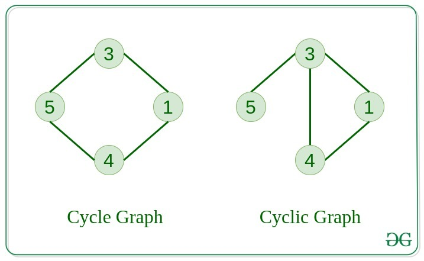
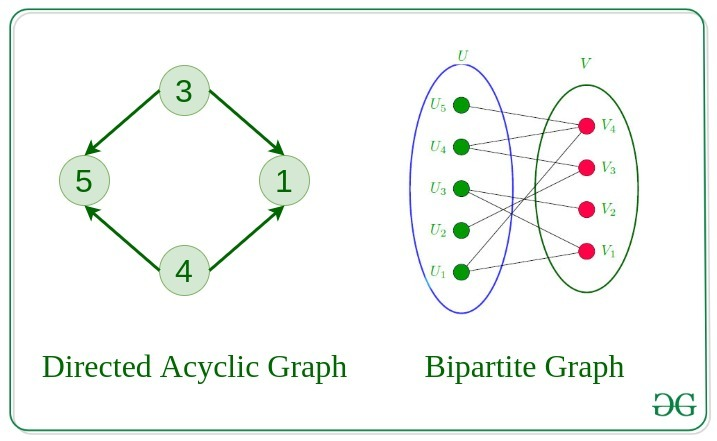

# Graph 
```bash
Graph Data Structure is a collection of nodes connected by edges. 
It's used to represent relationships between different entities. 
Graph algorithms are methods used to manipulate and analyze graphs,
solving various problems like finding the shortest path or detecting cycles.
```
# Introduction on Graph
```bash
Graph Data Structure is a (non-linear data structure) consisting of vertices and edges. 
It is useful in fields such as social network analysis, recommendation systems,
and computer networks. In the field of sports data science, graph data 
structure can be used to analyze and understand the dynamics of 
team performance and player interactions on the field.
 ```
# Components of Graph Data Structure
- Vertices: 
Vertices are the fundamental units of the graph. Sometimes, vertices are also 
known as vertex or nodes. Every node/vertex can be labeled or unlabelled.
- Edges:
Edges are drawn or used to connect two nodes of the graph. 
It can be ordered pair of nodes in a directed graph.
Edges can connect any two nodes in any possible way. 
There are no rules. Sometimes, edges are also known as arcs. Every edge can be labelled/unlabelled.

# Types Of Graphs in Data Structure and Algorithms
1. Null Graph : 
A graph is known as a null graph if there are no edges in the graph.

2. Trivial Graph : 
Graph having only a single vertex, it is also the smallest graph possible.


3. Undirected Graph : 
A graph in which edges do not have any direction. That is the nodes are unordered pairs in the definition of every edge. 

4. Directed Graph : 
A graph in which edge has direction. That is the nodes are ordered pairs in the definition of every edge.


5. Connected Graph
The graph in which from one node we can visit any other node in the graph is known as a connected graph. 

6. Disconnected Graph
The graph in which at least one node is not reachable from a node is known as a disconnected graph.


7. Regular Graph 
The graph in which the degree of every vertex is equal to K is called K regular graph.

1. Complete Graph
The graph in which from each node there is an edge to each other node.


9. Cycle Graph
The graph in which the graph is a cycle in itself, the minimum value of degree of each vertex is 2. 

1.  Cyclic Graph
A graph containing at least one cycle is known as a Cyclic graph.



1.  Directed Acyclic Graph
A Directed Graph that does not contain any cycle. 

1.  Bipartite Graph
A graph in which vertex can be divided into two sets such that vertex in each set does not contain any edge between them.



13. Weighted Graph
A graph in which the edges are already specified with suitable weight is known as a weighted graph. 
Weighted graphs can be further classified as directed weighted graphs and undirected weighted graphs. 


