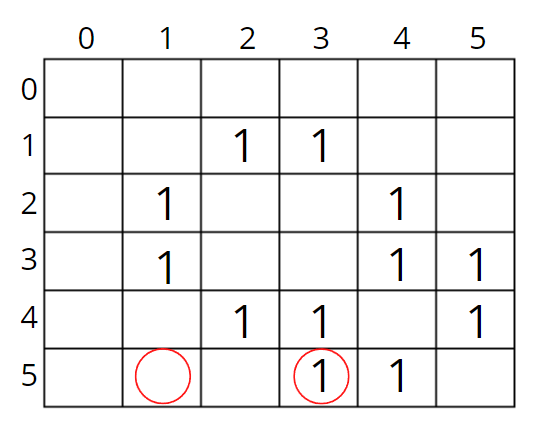
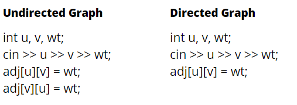
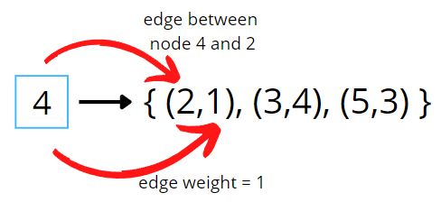

# Graph Representation in C++


# Input Format 
```bash

In the question, 
they will mention whether it is a directed or undirected graph.
The first line contains two space-separated integers n and m 
denoting the number of nodes and the number of edges respectively. 
Next m lines contain two integers u and v representing an edge between 
u and v. In the case of an undirected graph if there is an edge between 
u and v, it means there is an edge between v and u as well. Now the 
question arises if there is any boundation on the number of edges, 
i.e., the value of m? The answer is NO. If we add more edges, 
then the value of m will increase.
```

# Graph Representations
After understanding the input format, let us try to understand how the graph can be stored. 
The two most commonly used representations for graphs are

- Adjacency Matrix
- Adjacency Lists
# Adjacency Matrix
- An adjacency matrix of a graph is a two-dimensional array of size n x n, 
- where n is the number of nodes in the graph, with the property that a[ i ][ j ] = 1 if the edge (vᵢ, vⱼ) is in the set of edges, and a[ i ][ j ] = 0 if there is no such edge.

# Consider the example of the following undirected graph,
```bash
Input:
5 6
1 2
1 3
2 4
3 4 
3 5 
4 5

Explanation:
Number of nodes, n = 5
Number of edges, m = 6
Next m lines represent the edges.

```


- All the edges are marked in the adjacency matrix, remaining spaces in the matrix are marked as zero or left as it is.
  



```bash
This matrix will tell if there is an edge between two particular nodes. 
For example, there is an edge between 5 and 3 as 1 is at (5,3) 
but there is no edge between 5 and 1 as the space is empty 
(or can be filled with 0) at position (5,1) in the adjacency matrix.

The space needed to represent a graph using its adjacency 
matrix is n² locations. Space complexity = (n*n), 
It is a costly method as n² locations are consumed.

```
```bash
using namespace std;
int main()
{
    int n, m;
    cin >> n >> m;
    // adjacency matrix for undirected graph
    // time complexity: O(n)
    int adj[n+1][n+1];
    for(int i = 0; i < m; i++)
    {
        int u, v;
        cin >> u >> v;
        adj[u][v] = 1;
        adj[v][u] = 1  // this statement will be removed in case of directed graph
    }
    return 0;
}
```
# Adjacency Lists
```bash
In the previous storing method, we saw it was taking n² space to store the graph, 
this is where the adjacency list comes into the picture, it takes a very less amount of space.

This is a node-based representation. In this representation, we associate with each node a 
list of nodes adjacent to it. Normally an array is used to store the nodes. 
The array provides random access to the adjacency list for any particular node.
```
# Consider the example of the following undirected graph,


```bash
To create an adjacency list, we will create an array of size n+1
where n is the number of nodes.
This array will contain a list, so in C++ list is nothing but the vector of integers.
```
```bash
vector <int> adj[n+1];
```
- Now every index is containing an empty vector/ list. With respect to the example, 6 indexes contain empty vectors.
# What is the motive of the list?

- In the example, we can clearly see that node 4 has nodes 2, 3, 
  and 5 as its adjacent neighbors. So, to store its immediate neighbors in any order, we use the list.
```bash
#include <iostream>

using namespace std;

int main()
{
    int n, m;
    cin >> n >> m;
    // adjacency list for undirected graph
    // time complexity: O(2E)
    vector<int> adj[n+1];
    for(int i = 0; i < m; i++)
    {
        int u, v;
        cin >> u >> v;
        adj[u].push_back(v);
        adj[v].push_back(u);
    }
    return 0;
}

```
# Compare btw AdjList and AdjMatrix
```bash
Action	        AdjacencyMatrix	  Adjacency List
Adding  Edge	    O(1)	        O(1)
Removing an edge	O(1)	        O(N)
Initializing	    O(N*N)	        O(N)
```

# Weighted Graph Representation
- As of now, we were considering graphs with unit weight edges 
- (i.e., if there is an edge between two nodes then the weight on the edge is unit weight ), 
- now what if there are weights on its edges as shown in the following example



- But how are we going to implement it in the adjacency list?

- Earlier in the adjacency list, we were storing a list of integers in each index, 
- but for weighted graphs, we will store pairs (node, edge weight) in it

```bash
vector< pair <int,int> > adjList[n+1];
```



