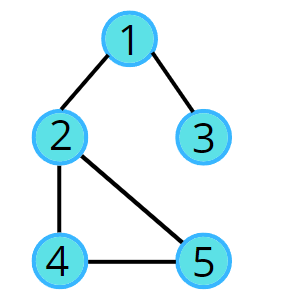
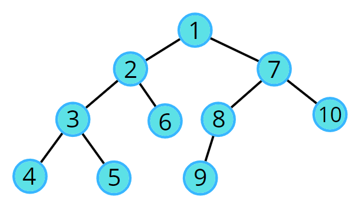

# Breadth First Search (BFS): Level Order Traversal
- Problem Statement: Given an undirected graph, return a vector of all nodes by traversing the graph using breadth-first search (BFS).
  


```bash 
Output: 1 2 5 3 4 

```
- Time Complexity: O(N) + O(2E), Where N = Nodes, 2E is for total degrees as we traverse all adjacent nodes.

- Space Complexity: O(3N) ~ O(N), Space for queue data structure visited array and an adjacency list

```bash

#include <bits/stdc++.h>
using namespace std;

class Solution {
  public:
    // Function to return Breadth First Traversal of given graph.
    vector<int> bfsOfGraph(int V, vector<int> adj[]) {
        vector<int> vis(V,0); 
        vis[0] = 1; 
        queue<int> q;
        // push the initial starting node 
        q.push(0); 
        vector<int> bfs; 
        // iterate till the queue is empty 
        while(!q.empty()) {
           // get the topmost element in the queue 
            int node = q.front(); 
            q.pop(); 
            bfs.push_back(node); 
            // traverse for all its neighbours 
            for(auto it : adj[node]) {
                // if the neighbour has previously not been visited, 
                // store in Q and mark as visited 
                if(!vis[it]) {
                    vis[it] = 1; 
                    q.push(it); 
                }
            }
        }
        return bfs; 
    }
};

void addEdge(vector <int> adj[], int u, int v) {
    adj[u].push_back(v);
    adj[v].push_back(u);
}

void printAns(vector <int> &ans) {
    for (int i = 0; i < ans.size(); i++) {
        cout << ans[i] << " ";
    }
}

int main() 
{
    int n,m;
    cin>>n>>m;
    vector <int> adj[n+1];
    for(int i =0; i<m; i++){
        int u, v;
        cin>>u>>v;
        addEdge(adj,u,v);
    }
    

    Solution obj;
    vector <int> ans = obj.bfsOfGraph(n, adj);
    printAns(ans);

    return 0;
}
```
# Depth First Search (DFS)


- Problem Statement: Given an undirected graph, return a vector of all nodes by traversing the graph using depth-first search (DFS).
- Examples
  


- output :  1 2 4 5 3



Output: 1 2 3 4 5 6 7 8 9 10


