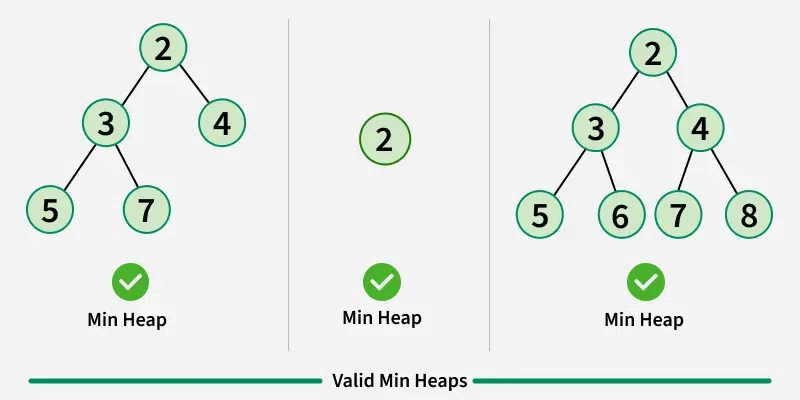

# Heap 

A Heap is a special Tree-based Data Structure that has the following properties.

- It is a complete Complete Binary Tree.
- It either follows max heap or min heap property.

# Max-Heap : 
```bash 
The value of the root node must be the greatest among 
all its descendant nodes and the same thing must be 
done for its left and right sub-tree also.
```

# Min-Heap:
```bash
 The value of the root node must be the smallest 
 among all its descendant nodes and the same 
 thing must be done for its left and right sub-tree also.
```
 
# Properties of Heap:

- The minimum or maximum element is always at the root of the heap, allowing constant-time access.
- The relationship between a parent node at index ‘i’ and its children is given by the formulas: left - - - child at index 2i+1 and right child at index 2i+2 for 0-based indexing of node numbers.
- As the tree is complete binary, all levels are filled except possibly the last level. And the last - - level is filled from left to right.
- When we insert an item, we insert it at the last available slot and then rearrange the nodes so that - the heap property is maintained.
- When we remove an item, we swap root with the last node to make sure either the max or min item is - removed. Then we rearrange the remaining nodes to ensure heap property (max or min)

# Operations Supported by Heap:
```bash
Operations supported by min – heap and max – heap are same. 
The difference is just that min-heap contains minimum element 
at root of the tree and max – heap contains maximum element at the root of the tree.
```

# Heapify: 
```bash
It is the process to rearrange the elements to maintain the 
property of heap data structure. It is done when root is removed 
(we replace root with the last node and then call heapify to ensure
that heap property is maintained) or heap is built (we call heapify 
from the last internal node to root) to make sure that the heap property
is maintained. This operation also takes O(log n) time.
```
- For max-heap, it makes sure the maximum element is the root of that binary tree and all descendants also follow the same property.
- For min-heap, it balances in such a way that the minimum element is the root and all descendants also follow the same property.

# Insertion: 

```bash
If we insert a new element into the heap since we 
are adding a new element into the heap so it will 
distort the properties of the heap so we need to 
perform the heapify operation so that it maintains 
the property of the heap. This operation also takes O(log n) time.

```
- Assume initially heap(taking max-heap) is as follows
```bash
          8
        /   \
       4     5
      / \
    1    2

    Now if we insert 10 into the heap

           8
        /    \
       4       5
     /  \      /
    1    2  10 

    After repeatedly comparing with the parent nodes and 
    swapping if required, the final heap will be look like this

           10
         /    \
        4      8
       /  \    /
      1    2  5

```    
# Deletion:
```bash
If we delete the element from the heap it always deletes
the root element of the tree and replaces it with the last element of the tree.
Since we delete the root element from the heap it will distort the 
properties of the heap so we need to perform heapify 
operations so that it maintains the property of the heap. 
```
```bash
Assume initially heap(taking max-heap) is as follows
           15
          /   \
         5     7
       /  \
      2   3


Now if we delete 15 into the heap it will be replaced by leaf node of the tree for temporary.
           3
        /   \
       5     7
     /    
    2


After heapify operation final heap will be look like this
           7
        /   \
       5     3
      /   
     2
```
# getMax (For max-heap) or getMin (For min-heap):
```bash
It finds the maximum element or minimum element for max-heap and min-heap
respectively and as we know minimum and maximum elements 
will always be the root node itself for min-heap and 
max-heap respectively. It takes O(1) time. 
```    
# removeMin or removeMax:
```bash
This operation returns and deletes the maximum element and
minimum element from the max-heap and min-heap respectively.
In short, it deletes the root element of the heap binary tree.
```
# **Implementation of Heap Data Structure:**
```bash
maxHeapify is the function responsible for restoring
 the property of the Max Heap. It arranges the node i, 
 and its subtrees accordingly so that the heap property is maintained.
 ```
 ```bash
- Suppose we are given an array, arr[] representing the complete binary tree.
 The left and the right child of ith node are in indices 2*i+1 and 2*i+2.
- We set the index of the current element, i, as the ‘MAXIMUM’.
- If arr[2 * i + 1] > arr[i], i.e., the left child is 
larger than the current value, it is set as ‘MAXIMUM’.
Similarly if arr[2 * i + 2] > arr[i], i.e., the right child is 
larger than the current value, it is set as ‘MAXIMUM’.
Swap the ‘MAXIMUM’ with the current element.
Repeat steps 2 to 5 till the property of the heap is restored.

  ```