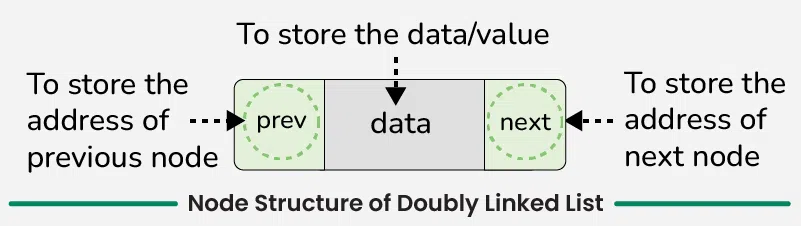
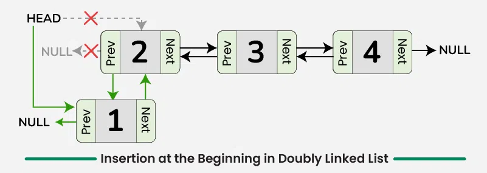

## What is Linked List ?

A linked list is a fundamental data structure in computer science. It mainly allows efficient insertion and deletion operations compared to arrays. Like arrays, it is also used to implement other data structures like stack, queue and deque. Here’s the comparison of Linked List vs Arrays
``` bash 
Linked List:

Data Structure: Non-contiguous
Memory Allocation: Typically allocated one by one to individual elements
Insertion/Deletion: Efficient
Access: Sequential

Array:

Data Structure: Contiguous
Memory Allocation: Typically allocated to the whole array
Insertion/Deletion: Inefficient
Access: Random
```
# Basic of Linked List 
 # Singly linked list
 ``` bash
 A singly linked list is a fundamental data structure in computer science and programming, it consists of nodes where each node contains a data field and a reference to the next node in the node. The last node points to null, indicating the end of the list. This linear structure supports efficient insertion and deletion operations, making it widely used in various applications. In this tutorial, we'll explore the node structure, understand the operations on singly linked lists (traversal, searching, length determination, insertion, and deletion), and provide detailed explanations and code examples to implement these operations effectively.

 ```

 ``` bash
 In a singly linked list, each node consists of two parts: data and a pointer to the next node. The data part stores the actual information, while the pointer (or reference) part stores the address of the next node in the sequence. This structure allows nodes to be dynamically linked together, forming a chain-like sequence.
 ```

#  Operations on Singly Linked List
``` bash 
Traversal
Searching
Length

Insertion:

``` bash
Insert at the beginning
Insert at the end
Insert at a specific position
```
``` bash
Deletion:
Delete from the beginning
Delete from the end
Delete a specific node
```


# Traversal Singly Linked List
```bash

Traversal involves visiting each node in the linked list and performing some operation on the data. 
A simple traversal function would print or process the data of each node.

Step-by-step approach:

Initialize a pointer current to the head of the list.
Use a while loop to iterate through the list until the current pointer reaches NULL.
Inside the loop, print the data of the current node and move the current pointer to the next node.


```

# Seaching in Linked List

```bash 
Searching in a Singly Linked List refers to the process of looking for a specific element or value within the elements of the linked list.

Step-by-step approach:

Traverse the Linked List starting from the head.

Check if the current node's data matches the target value.
If a match is found, return true.
Otherwise, Move to the next node and repeat steps 2.
If the end of the list is reached without finding a match, return false.

```
# Doubly linked list

```bash
A doubly linked list is a more complex data structure than a singly linked list, but it offers several advantages. The main advantage of a doubly linked list is that it allows for efficient traversal of the list in both directions. This is because each node in the list contains a pointer to the previous node and a pointer to the next node. This allows for quick and easy insertion and deletion of nodes from the list, as well as efficient traversal of the list in both directions.

```
# What is a Doubly Linked List?
```bash

A doubly linked list is a data structure that consists of a set of nodes, each of which contains a value and two pointers, one pointing to the previous node in the list and one pointing to the next node in the list. This allows for efficient traversal of the list in both directions, making it suitable for applications where frequent insertions and deletions are required.
```

# Representation of Doubly Linked List in Data Structure
```bash

In a data structure, a doubly linked list is represented using nodes that have three fields:

Data
A pointer to the next node (next)
A pointer to the previous node (prev)
```


# Operations on the DoublyLinkedList
# Traversal
```bash

Traversal in Doubly Linked List
To Traverse the doubly list, we can use the following steps:

a. Forward Traversal:

Initialize a pointer to the head of the linked list.
While the pointer is not null:
Visit the data at the current node.
Move the pointer to the next node.

b. Backward Traversal:

Initialize a pointer to the tail of the linked list.
While the pointer is not null:
Visit the data at the current node.
Move the pointer to the previous node.
```
# Insertion at the Beginning in Doubly Linked List
