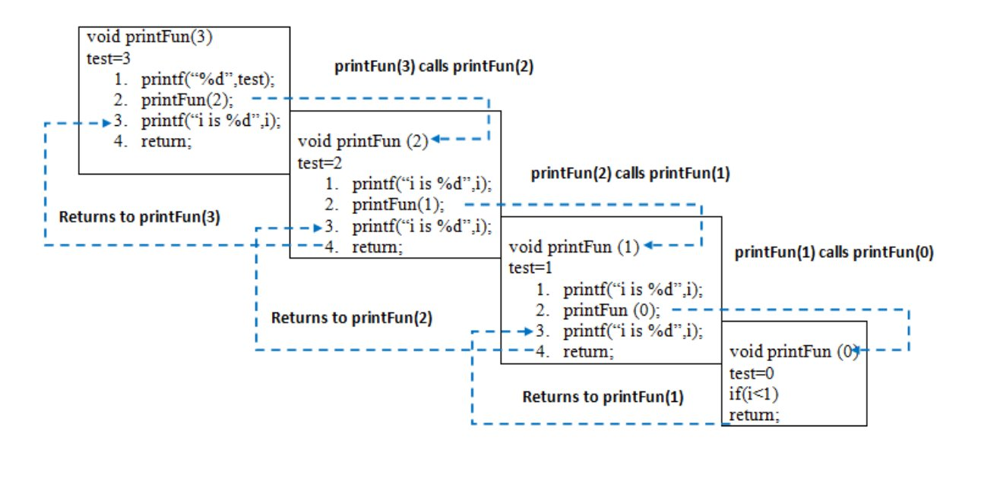

# Recursion 
```bash
Recursion is technique used in computer science to solve big problems by breaking them into smaller, similar problems. The process in which a function calls itself directly or indirectly is called recursion and the corresponding function is called a recursive function. Using a recursive algorithm, certain problems can be solved quite easily.

```
# What is Recursion?
```bash
- Recursion is a programming technique where a function calls itself within its own definition.
- This allows a function to break down a problem into smaller subproblems, which are then solved recursively.

```

# How Does Recursion Work?
```bash

- Recursion works by creating a stack of function calls. When a function calls itself, 
- a new instance of the function is created and pushed onto the stack. This process continues until a base - - case is reached, which is a condition that stops the recursion. Once the base case is reached, the - -   - - function calls start popping off the stack and returning their results.
```
# What is a Recursive Algorithm?
```bash

- A recursive algorithm is an algorithm that uses recursion to solve a problem. Recursive algorithms  typically have two parts:
```
# Base case:
```bash
-  Which is a condition that stops the recursion.
```
#  Recursive case:
```bash

- Which is a call to the function itself with a smaller version of the problem.
```
# Types of Recursion 
```bash

- There are several different recursion types and terms. These include:
```
# Direct recursion: 
```bash
- This is typified by the factorial implementation where the methods call itself.
``` 
# In-Direct recursion:
```bash
This happens where one method, say method A, calls another method B, which then calls method A. This involves two or more methods that eventually create a circular call sequence.
```
# Head recursion:
```bash
- The recursive call is made at the beginning of the method.
```
# Tail recursion:
```bash

 The recursive call is the last statement.
 ```
 # When to Use Recursion?
 ```bash
 
Recursion is a powerful technique that can be used to solve a wide variety of problems.
However, it is important to use recursion carefully, as it can lead to stack overflows if not used properly.

Recursion should be used when 

The problem can be broken down into smaller subproblems that can be solved recursively.
The base case is easy to identify.
The recursive calls are tail recursive.
```
# Applications of Recursion Algorithms: 
```bash

Here are some common applications of recursion:

Tree and Graph Traversal: Depth-first search (DFS) and breadth-first search (BFS)
Dynamic Programming: Solving optimization problems by breaking them into smaller subproblems
Divide-and-Conquer: Solving problems by dividing them into smaller parts, solving each part recursively, 
and 
combining the results
Backtracking: Exploring all possible solutions to a problem by recursively trying different options
Combinatorics: Counting or generating all possible combinations or permutations of a set
```
# what is Recursion ? 
```bash
The process in which a function calls itself directly or indirectly is called recursion and the corresponding function is called a recursive function. Using a recursive algorithm, certain problems can be solved quite easily. Examples of such problems are Towers of Hanoi (TOH)
 Inorder/Preorder/Postorder Tree Traversals, DFS of Graph, etc. A recursive function solves a particular problem by calling a copy of itself and solving smaller subproblems of the original problems. Many more recursive calls can be generated as and when required. It is essential to know that we should provide a certain case in order to terminate this recursion process. So we can say that every time the function calls itself with a simpler version of the original problem.
```
# Algorithmic steps :
```bash 
The algorithmic steps for implementing recursion in a function are as follows:

Step1 - Define a base case: Identify the simplest case for which the solution is known or trivial. This is the stopping condition for the recursion, as it prevents the function from infinitely calling itself.

Step2 - Define a recursive case: Define the problem in terms of smaller subproblems. Break the problem down into smaller versions of itself, and call the function recursively to solve each subproblem.

Step3 - Ensure the recursion terminates: Make sure that the recursive function eventually reaches the base case, and does not enter an infinite loop.

step4 - Combine the solutions: Combine the solutions of the subproblems to solve the original problem.
```
# How are recursive functions stored in memory?
```bash


Recursion uses more memory, because the recursive function adds to the stack with each recursive call
keeps the values there until the call is finished. The recursive function uses 
LIFO (LAST IN FIRST OUT) 
Structure just like the stack data structure.
```

# What is the base condition in recursion? 
```bash 
In the recursive program, the solution to the base case is provided and
the solution to the bigger problem is expressed in terms of smaller problems. 
 

int fact(int n)
{
    if (n < = 1) // base case
        return 1;
    else    
        return n*fact(n-1);    
}
In the above example, the base case for n < = 1 is defined 
and the larger value of a number can be solved by converting to a 
smaller one till the base case is reached.
```
# What is the difference between direct and indirect recursion? 
```bash
A function fun is called direct recursive if it calls the same function fun. 
A function fun is called indirect recursive if it calls 
another function say fun_new and fun_new calls fun directly or indirectly
```
# Example
```bash
// An example of direct recursion
void directRecFun()
{
    // Some code....

    directRecFun();

    // Some code...
}

// An example of indirect recursion
void indirectRecFun1()
{
    // Some code...

    indirectRecFun2();

    // Some code...
}
void indirectRecFun2()
{
    // Some code...

    indirectRecFun1();

    // Some code...
}
```
# What Is Tail Recursion ?
```bash
Tail recursion is defined as a recursive function in which the recursive call is the last
statement that is executed by the function. So basically nothing is left to execute after
the recursion call.
```
# Example
```bash
static void print(int n)
{
    if (n < 0)
        return;
    cout << " " << n;
  
    // The last executed statement is recursive call
    print(n - 1);
}
```
# Time Complexity: O(n)
# Auxiliary Space: O(n)
# Need for Tail Recursion: 
```bash
The tail recursive functions are considered better than non-tail 
recursive functions as tail-recursion can be optimized by the compiler. 

Compilers usually execute recursive procedures by using a stack. 
This stack consists of all the pertinent information, including the parameter values, for
each recursive call. When a procedure is called, its information is pushed onto a stack, and when the function terminates the information is popped out of the stack. Thus for the non-tail-recursive functions, the stack depth (maximum amount of stack space used at any time during compilation) is more. 
```
# Tail Call Elimination
```bash 
void print(int n) 
{ 
start: 
    if (n < 0)  
       return; 
    cout << " " << n; 
  
    // Update parameters of recursive call 
    // and replace recursive call with goto 
    n = n-1 
    goto start; 
}

```
# Important Note:

```bash
Tail call elimination reduces the space complexity of recursion from O(N) to O(1).
As function call is eliminated, no new stack frames are created and the function
is executed in constant memory space. 
```

#  A C++ program to demonstrate working of recursion
```bash 
include <bits/stdc++.h>
using namespace std;

void printFun(int test)
{
    if (test < 1)
        return;
    else {
        cout << test << " ";
        printFun(test - 1); // statement 2
        cout << test << " ";
        return;
    }
}

// Driver Code
int main()
{
    int test = 3;
    printFun(test);
}
```
# Output 
```bash
3 2 1 1 2 3
```
```bash
Time Complexity: O(1)
Auxiliary Space: O(1)

When printFun(3) is called from main(), memory is allocated to printFun(3) and a local variable test is 
initialized to 3 and statement 1 to 4 are pushed on the stack as shown in below diagram. It first prints ‘3’. In statement 2, printFun(2) is called and memory is allocated to printFun(2) and a local variable test is initialized to 2 and statement 1 to 4 are pushed into the stack. Similarly, printFun(2) calls printFun(1) and printFun(1) calls printFun(0). printFun(0) goes to if statement and it return to printFun(1). The remaining statements of printFun(1) are executed and it returns to printFun(2) and so on. In the output, values from 3 to 1 are printed and then 1 to 3 are printed. The memory stack has been shown in below diagram.

```



