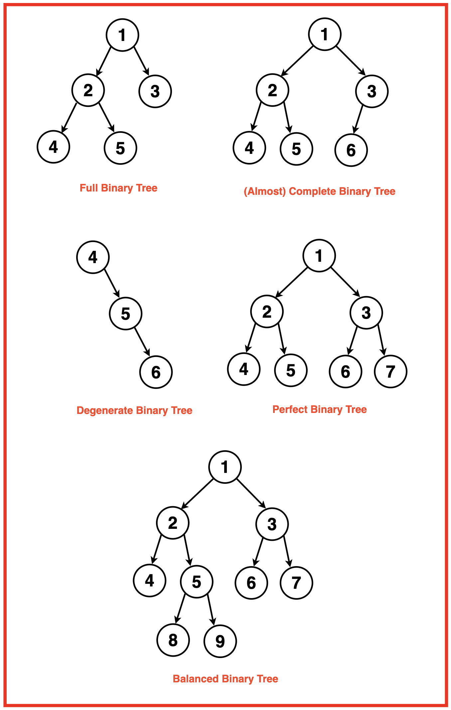
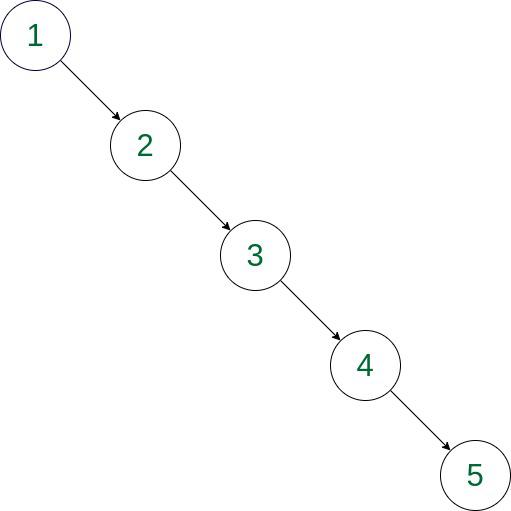

# Tree

```bash
Tree Data Structure is a non-linear data structure in which 
a collection of elements known as nodes are connected 
to each other via edges such that there exists exactly
one path between any two nodes.
```
```bash
Tree data structure is a hierarchical structure that is used to represent 
and organize data in a way that is easy to navigate and search. 
It is a collection of nodes that are connected by edges and has a 
hierarchical relationship between the nodes.
The topmost node of the tree is called the root, and the nodes 
below it are called the child nodes. Each node can have multiple 
child nodes, and these child nodes can also have their
own child nodes, forming a recursive structure.
```
# Why Tree is considered a non-linear data structure?
```bash
The data in a tree are not stored in a sequential manner i.e., they are not stored linearly. 
Instead, they are arranged on multiple levels or we can say it is a 
hierarchical structure. For this reason, the tree is considered 
to be a non-linear data structure.
```
# Types of Tree data structures:

# Binary tree: 
```bash
In a binary tree, each node can have a maximum of two children linked to it.
Some common types of binary trees include full binary trees, complete binary trees,
balanced binary trees, and degenerate or pathological binary trees. 
Examples of Binary Tree are Binary Search Tree and Binary Heap.
```
# Ternary Tree:
```bash
A Ternary Tree is a tree data structure in which each node has 
at most three child nodes, usually distinguished as “left”, “mid” and “right”.
```
# N-ary Tree or Generic Tree: 
```bash
Generic trees are a collection of nodes where each node is a 
data structure that consists of records and a list of 
references to its children(duplicate references are not allowed). 
Unlike the linked list, each node stores the address of multiple nodes.
```
# Basic Operations Of Tree Data Structure:
- Create – create a tree in the data structure
- Insert − Inserts data in a tree.
- Search − Searches specific data in a tree to check whether it is present or not.
- Traversal - Depth-First-Search Traversal  or Breadth-First-Search Traversal

# Type of Tree Representation


# Binary Tree Traversal
- Depth First-Search Traversal
- PreOrder Traversal
- InOrder Traversal
- PostOrder Traversal

_________________________________________________________________________________________________________

- Breadth First-Search Traversal
- Level order Traversal
________________________________________________________________________________________________________


# Degenerate Binary Tree

```bash
Every non-leaf node has just one child in a binary 
tree known as a Degenerate Binary tree. The tree effectively transforms 
into a linked list as a result, with each node linking to its single child.
```
# Types of Degenerate Binary Tree
```bash
- Left-skewed Tree:  If all the nodes in the degenerate tree have only a left child.
- Right-skewed Tree: If all the nodes in the degenerate tree have only a right child.
```
# Right-skewed Tree

# Time Complexity: O(N)
# Auxiliary Space: O(N)
